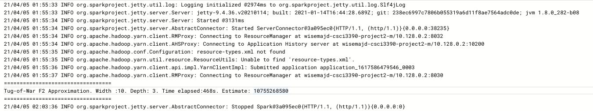
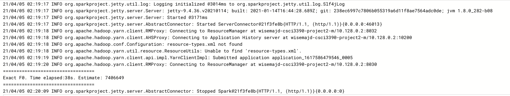

# Project 2 Results

## Exact F2 vs Tug of War
When running my implementation of exactF2 on GCP, as can be seen below, it ran in 39 seconds and found the F2 to be 8567966130.

Running the Tug of War algorithm however, ran in 468 seconds, and estimated F2 to be 10755268580, within ~25% of the actual.

Just out of curiosity, I ran the Tug of War estimate a second time with width and depth set to 1, to compare the runtime of a single trial. This ran in 28 seconds, but its estimate was far less accurate.

## Exact F0 vs BJKST Sketch

Running the exactF0 on GCP took 38s, and gave an estimate of 7406649.

Unfortunately, I was unable to completely implement the BJKST algorithm, please see the source code for what I was able to do.

